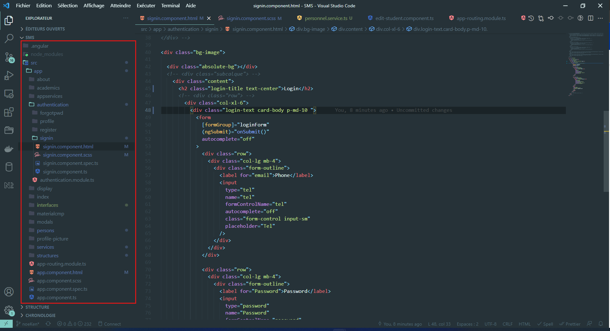
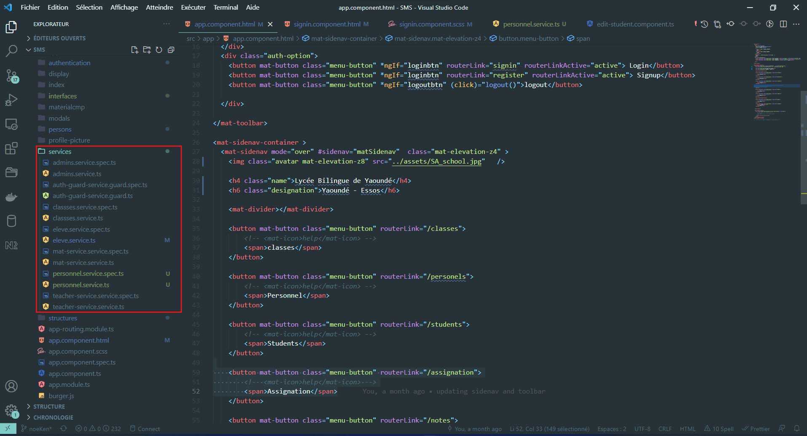

# School
***
School is an SMS, for School management system.

## Table of Contents
1. [General Info](#general-info)
2. [Technologies](#technologies)
3. [Installation](#installation)
4. [Collaborators](#collaborators)
<!-- 5. [FAQs](#faqs) -->

***
## General Info
***
School is a platform designed and dedicated especially for the electronic management of schools (high schools and colleges).

It should be noted that this project takes into account the notion of object-oriented, 
especially in the "component.ts" files (where the logic of the component in question is defined) in each component of the platform
***
### CONCEPTS USED
-> object-oriented programming:
   - [Classe]
   - [Interface]
   - [extentiation]
   - [heritage]
   - etc.
-> SOLID principle :
   - [SRP] : single-responsibility principle
   - [ISP] : Interface Segregation Principle
***
### SOURCE CODE ORGANISATION
***
The code organisation is as follows :

components have been grouped into modules inorder to separate different application view layers 

the modules and their content components are :
-> display [header, footer, main]
-> authentication [signin, register, forgotpwd]
-> academics [notes, assignment, reports]
-> structures [schools, classes]
-> persones [peronel, students]

***
#### The materialcmp modules
This module serves only to import material components

***
#### The Services folder
This folder will contain all our services that we will use in this project shall be organised as time goes on.
	however, it should be noted that each service is unique, described a specific feature

***
### Screenshot

***
### The interfaces folder
here are defined our various worn interfaces; 
the latter usually contain the structure of the different concepts of the application, 
for example that of "class, administratif, personal..."

### The tp301 folder
this folder is located at the root of the project, and contains all the [php] requests of the back-end.
## Technologies
This project was generated with 
  -> [Angular CLI](https://github.com/angular/angular-cli) version 13.0.4 for the front-end,
  -> [php] for the back-end,
  -> [mysql] database.

## Installation
### Prerequisites
Before you can deploy this pojet, you must first configure the development environment, including:
  -> you must install the [Angular CLI](https://github.com/angular/angular-cli)
  -> you should have a [Wampserver](https://www.wampserver.com/en/download-wampserver-64bits/)
  or [Xampp](https://www.apachefriends.org/download.html)

***
### local deploiement
Once the necessary is installed, follow these steps to conifgure the environment
-> Copy the [tp301] folder and put it in the local server directory
-> Open [phpMyAdmin] and create a new database named [ict301]
-> Copy the [ict301.sql] file at the root of the project and import it into the new created database

After that, you can run the servers:
  - Wamp or Xampp server
  - Development server as following
### Development server

Run `ng serve` for a dev server. Navigate to `http://localhost:4200/` if this port is not used yet, otherwise, the port will be specified after the development server is launched  .

Run `ng serve -o` allows you to automatically navigate to the web page, following the link given to the start of the server.
The app will automatically reload if you change any of the source files.

### Code scaffolding

Run `ng generate component component-name` to generate a new component. You can also use `ng generate directive|pipe|service|class|guard|interface|enum|module`.

### Build

Run `ng build` to build the project. The build artifacts will be stored in the `dist/` directory.

### Running unit tests

Run `ng test` to execute the unit tests via [Karma](https://karma-runner.github.io).

### Running end-to-end tests

Run `ng e2e` to execute the end-to-end tests via a platform of your choice. To use this command, you need to first add a package that implements end-to-end testing capabilities.

### Further help

To get more help on the Angular CLI use `ng help` or go check out the [Angular CLI Overview and Command Reference](https://angular.io/cli) page.
"# School" 
## Collaborators
this project was produced with the contribution of [ ] followed by the name of their different branches on github:
-> Noe Kenfack   [noeKen]
-> Joseph Feussi [owaldsky],[joseph]
-> Oben Dorcas   [Oben]
-> Bika Fernand  [bika]
